# fitlog

تطبيق Desktop لتتبع اللياقة مكتوب بـ **C# / Avalonia UI** مع قاعدة بيانات **SQLite** محلية. التصميم مستوحى من الصور المرفقة؛ يدعم الإنكليزية والعربية مع اتجاه من اليمين لليسار. التطبيق نافذة Desktop فعلية، ولا يستخدم متصفحاً أو WebView.

> A native C# and Avalonia fitness tracker for daily attendance, custom workout schedules, weight progress, and photo albums. Your data stays in a local SQLite database.

**تنزيل Windows:** [المُثبّت Fitlog 1.2.0](https://github.com/iraqi-man1/first-c-/releases/download/v1.2.0/Fitlog-Setup-1.2.0-win-x64.exe)

## صور التطبيق / Screenshots

الصور التالية من واجهات التطبيق الفعلية. البيانات المعروضة تجريبية للاختبار؛ صورة المقارنة تستخدم اللوكو المولّد كصورة مثال فقط.

| Dashboard | الجدول الأسبوعي |
|---|---|
| 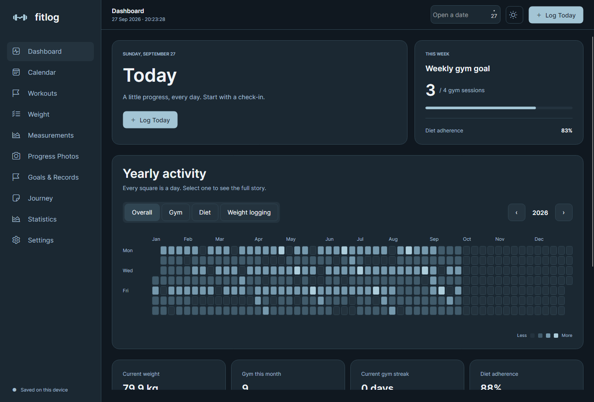 | 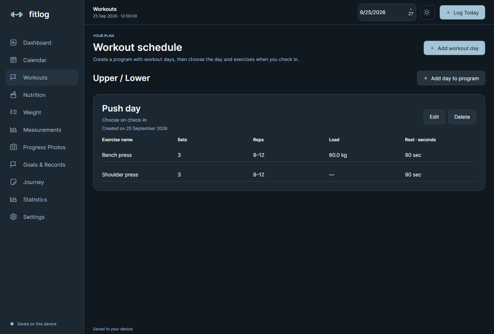 |

| جدول الغذاء | محرر الوجبات بالعربية |
|---|---|
| 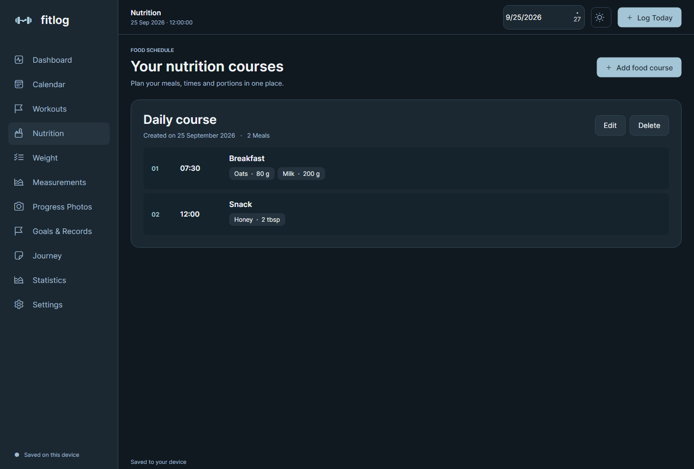 | 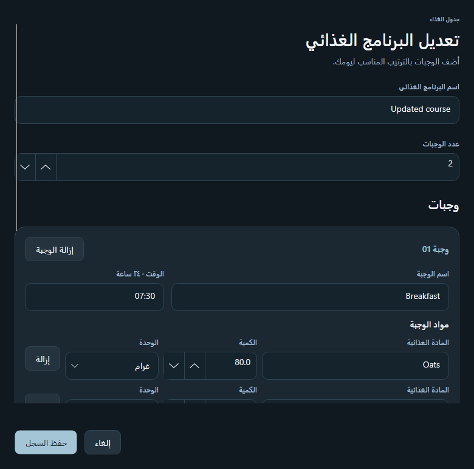 |

| تطوّر أوزان التمارين في الأهداف | محرر الوجبات متعددة المواد |
|---|---|
| 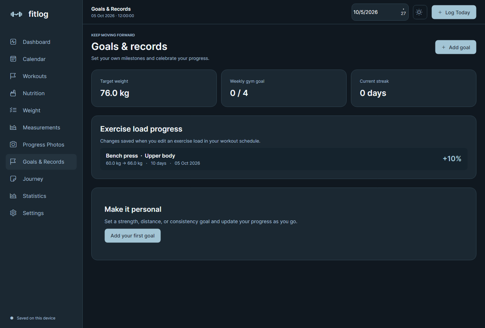 | 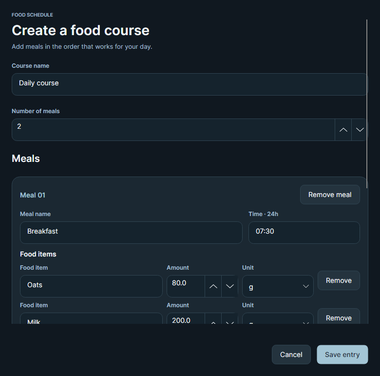 |

| جدول الغذاء بالعربية في نافذة صغيرة |
|---|
| 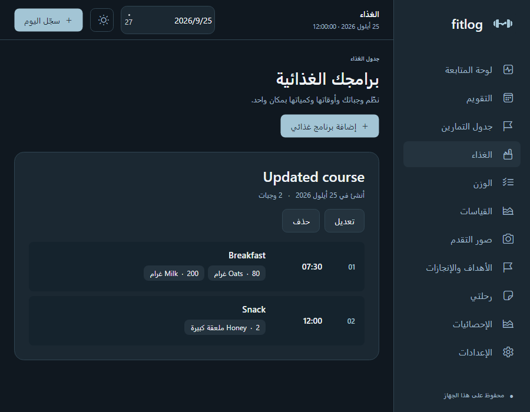 |

| Calendar | Weight progress |
|---|---|
| 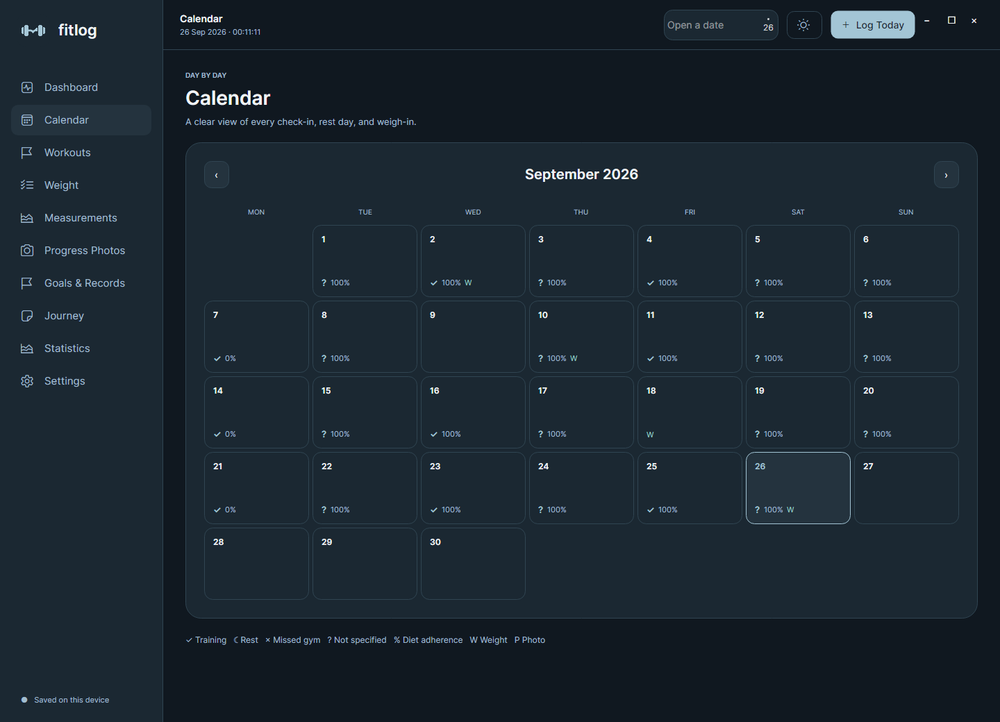 | 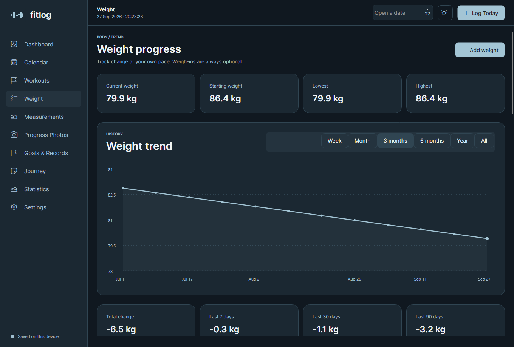 |

| English settings | الإعدادات بالعربية |
|---|---|
| 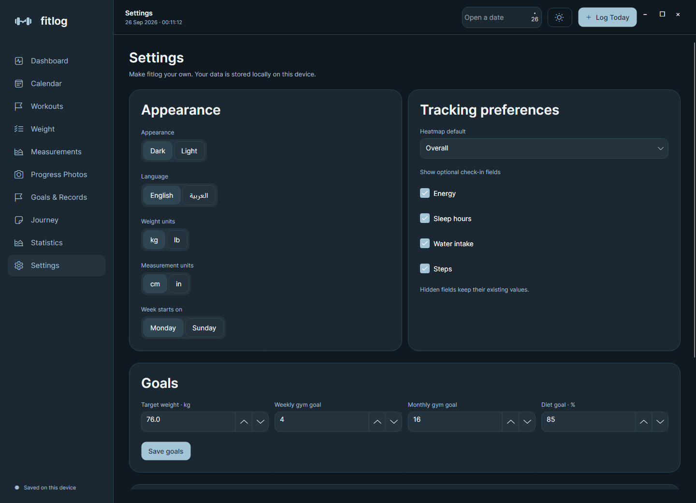 | 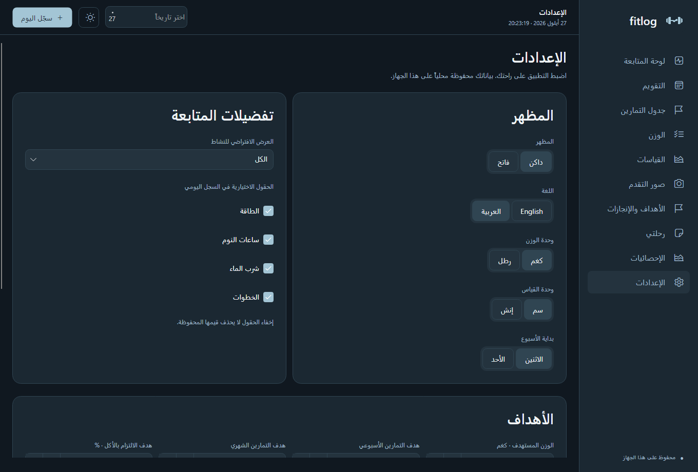 |

| لوحة المتابعة بالعربية | Photo comparison |
|---|---|
| 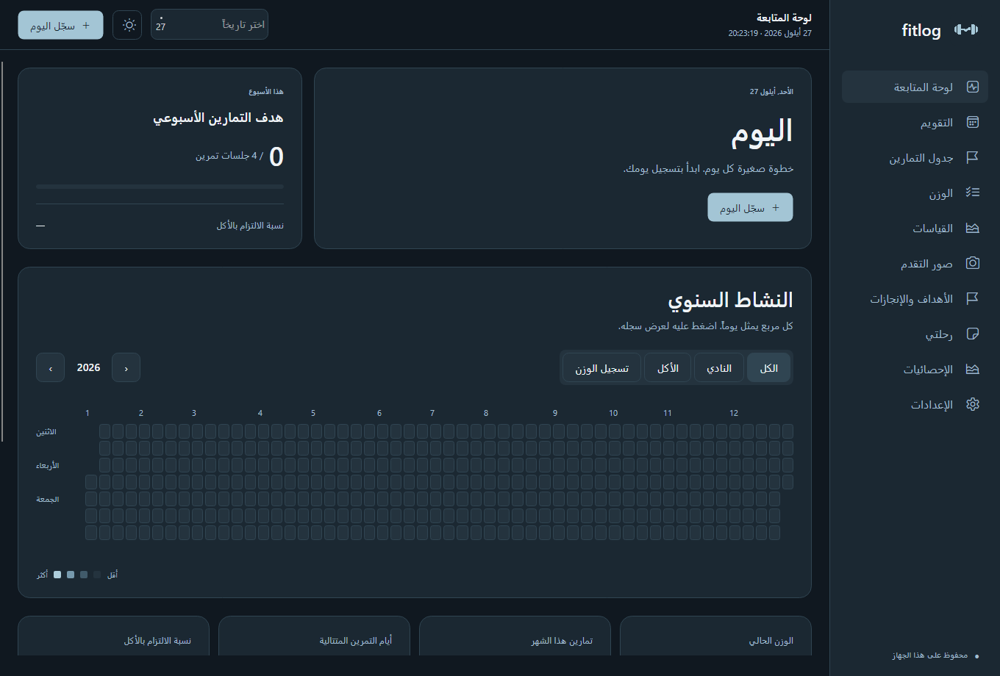 | 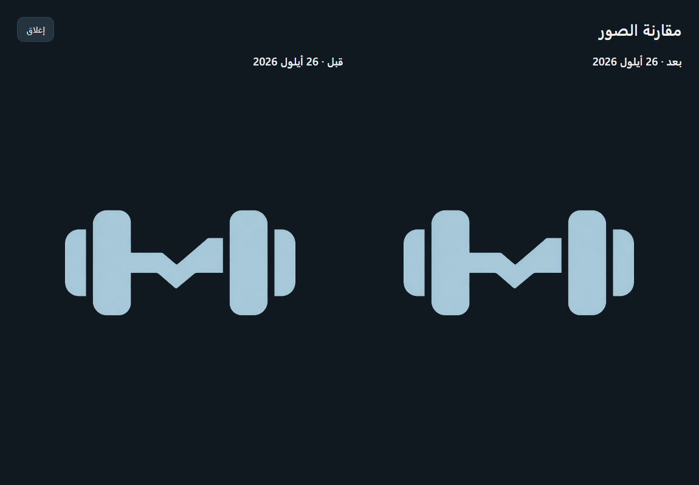 |

## التحديث الأخير

- إصدار **1.2.0**: عند تغيير وزن تمرين في جدول التمارين، يسجّل التطبيق الوزن السابق والجديد وتاريخ التغيير، ويعرض نسبة التغيّر والمدة في **الأهداف والإنجازات**. إذا كان تاريخ الوزن القديم غير معروف، يعرض أن المدة غير مسجّلة.
- صفحة **الغذاء** لإنشاء برنامج غذائي بعدة وجبات؛ كل وجبة تحتوي مادة غذائية واحدة أو أكثر، ولكل مادة كمية مستقلة بالغرام أو الملعقة. يبقى وقت الوجبة وتاريخ إنشاء البرنامج محفوظين عند التعديل وتدخل المواد في النسخة الاحتياطية. الوجبات القديمة التي كانت تحتوي مادة واحدة تظهر وتُعدَّل بصورة طبيعية.
- حقول الكتابة والأرقام وقوائم الاختيار بتنسيق غائر ومتناسق مع الثيم الداكن والفاتح.
- ساعة محلية مباشرة تتحدث كل ثانية، مع تحديث اليوم والتقويم عند منتصف الليل أو تغيير وقت الجهاز؛ بدون إعادة تشغيل.
- حالات التسجيل اليومي: **يوم تمرين / يوم راحة / ما رحت للجم**. نسبة إنجاز التمرين ونسبة الالتزام بالأكل حقول منفصلة من 0 إلى 100. السجلات القديمة محفوظة؛ الحالة غير المعروفة لا تُحوَّل إلى راحة أو غياب بشكل تلقائي.
- العربية من **Settings → Language → العربية**؛ الاختيار محفوظ بعد إعادة الفتح.
- ألوان التحديد والحقول ثابتة حسب ثيم التطبيق، بما فيها حالة التركيز أثناء الكتابة؛ لا ترث اللون الأحمر من Windows.
- صفحة **Workouts** مخصصة للجدول الأسبوعي فقط: جلسات مخصصة، أيام التكرار، تمارين بأسماء حرة، جولات وتكرارات ووزن وراحة. تسجيل الحضور يبقى في **Log Today**، والسجلات السابقة في **Journey**.
- الصور: إنشاء ألبومات وتسميتها، إضافة عدة صور دفعة واحدة إلى ألبوم، نقل الصور بين الألبومات، اختيار صورتين للمقارنة جنباً إلى جنب، والنقر على صورة لفتح عارض أكبر مع تكبير وتصغير وتنقل.
- تستخدم النافذة شريط عنوان وإطار Windows الأصليين للسحب والتكبير بالنقر المزدوج وSnap وتغيير الحجم من الحواف والزوايا واختصارات Win + الأسهم. بقيت هوية الواجهة ومحتوى الهيدر كما هما.
- لوكو جديد مولّد كصورة: راجع [الأصل ووصف التوليد](Fitlog/Assets/README.md).

## التشغيل على Windows

شغّل التطبيق من المصدر:

```powershell
.\run.ps1
```

السكربت يستخدم SDK المحلي الموجود في `%LOCALAPPDATA%\FitlogTools\dotnet` إن توفر، أو `dotnet` الموجود في PATH. لتطوير المشروع على جهاز آخر ثبّت **.NET 10 SDK** وافتح `Fitlog.slnx`، ثم:

```powershell
dotnet restore Fitlog.slnx
dotnet run --project Fitlog
```

## الوظائف

- **Dashboard:** حالة اليوم، هدف التمارين الأسبوعي، خريطة النشاط السنوي القابلة للتصفية وفتح الأيام، وإحصائيات ناتجة من البيانات المحفوظة.
- **Calendar:** تصفح الأشهر، تغيير بداية الأسبوع، وفتح سجل يوم سابق أو اليوم الحالي.
- **Daily check-in:** حالة اليوم ونسب إنجاز التمرين والالتزام الغذائي، وصف التمرين ومدته، الخطوات، الماء، النوم، الطاقة، والملاحظات. يمكن تعديل السجل أو حذفه.
- **Nutrition:** برامج غذائية بعدد وجبات قابل للتغيير، ووقت لكل وجبة، وعدة مواد غذائية بكميات ووحدات مستقلة؛ تاريخ الإنشاء محفوظ عند التعديل.
- **Weight:** إضافة وتعديل وحذف الوزن، مخطط بفترات مختلفة، أعلى وأدنى وزن، وفروق 7/30/90 يوماً. إدخال نفس التاريخ يحدّث وزنه.
- **Measurements:** تسجيل محيط الخصر والصدر والورك وتعديلها وحذفها.
- **Progress Photos:** حفظ صور JPEG/PNG حتى 10 MB للصورة مع تاريخ وتعليق؛ ألبومات ومقارنة وتكبير، وإضافة حتى 20 صورة في الدفعة الواحدة. الصور داخل قاعدة البيانات والنسخ الاحتياطية.
- **Goals & Records:** أهداف شخصية قابلة للتعديل مع نسبة الإنجاز، وسجل تغيّر أوزان التمارين مع النسبة المئوية والمدة بين التغييرات، وهدف الوزن والتمارين.
- **Journey / Statistics:** سجل يومي زمني وإحصائيات النشاط الشهرية والمتوسطات.
- **Settings:** اللغة العربية والإنكليزية، الوضع الداكن والفاتح، kg/lb، cm/in، بداية الأسبوع، تفضيلات التسجيل والأهداف، واستيراد وتصدير النسخ الاحتياطية.

## البيانات والنسخ الاحتياطية

المسار الافتراضي:

```text
%LOCALAPPDATA%\Fitlog\fitlog.db
```

تُحفظ البيانات بعد الضغط على Save؛ وحدات العرض لا تغير وحدات التخزين الأساسية (kg وcm). إخفاء الحقول الاختيارية يحافظ على قيمها القديمة.

استخدم **Settings → Export backup** لإنتاج ملف JSON يشمل كل البيانات والصور والألبومات وجدولي الغذاء والتمارين. صيغة التصدير الجديدة Version 2، مع دعم استيراد النسخ السابقة Version 1. الاستيراد يتحقق من القيم قبل الكتابة، ويستخدم معاملة SQLite واحدة. يدمج السجلات ويحدّث التواريخ/المعرفات المتطابقة. قبل الاستيراد تحفظ الواجهة نسخة استرجاع في مجلد `Backups` بجانب قاعدة البيانات. لا توجد مزامنة سحابية أو حسابات مستخدمين.

يمكن تشغيل مساحة بيانات منفصلة:

```powershell
dotnet run --project Fitlog -- --data-dir ./my-test-data
```

## الحسابات

- الالتزام الغذائي = متوسط النسب المدخلة للأيام المسجلة؛ الأيام غير المسجلة لا تدخل بالحساب. السجلات القديمة تستخدم 100% عند الالتزام و0% عند عدمه.
- تسلسل النادي يحسب أياماً متتالية حتى اليوم، أو حتى أمس إذا لم تتمرن اليوم.
- فرق الوزن لفترة معينة يقارن آخر وزن بأحدث وزن مسجل في تاريخ بداية الفترة أو قبله. تظهر `—` إذا لم يوجد تاريخ كافٍ للمقارنة.
- الدقائق والخطوات والماء والنوم قيم يدخلها المستخدم؛ لا توجد اتصالات بأجهزة تتبع أو تقديرات طبية.

## بنية المشروع

```text
Fitlog/
  App.axaml                  الثيم والأنماط المشتركة
  MainWindow.cs              النافذة والتنقل وعناصر التصميم
  Views/                     الصفحات ونوافذ الإدخال
  Controls/WeightChart.cs    مخطط الوزن المرسوم بـ Avalonia
  Models/                    النماذج وحسابات الإحصائيات
  Data/FitnessRepository.cs  SQLite والتحقق والنسخ الاحتياطية
Fitlog.Tests/                اختبارات التخزين والحسابات والتفاعل
```

قاعدة البيانات تستخدم جدول `records` بمفتاح مركب `(kind, id)` وحمولة JSON محددة بالنماذج. سجلات اليوم والوزن والقياسات تستخدم تاريخ ISO كمفتاح، والأهداف والصور تستخدم GUID. جميع أوامر SQL ذات معاملات parameterized.

## إنشاء نسخة Windows وملف التثبيت

المتطلبات على جهاز البناء: Windows، و.NET 10 SDK، و[Inno Setup 6 أو 7](https://jrsoftware.org/isdl.php). من جذر المستودع شغّل:

```powershell
.\scripts\Build-Release.ps1
```

يشغّل السكربت الاختبارات، ويولّد أيقونة التطبيق ورسومات المُثبّت، ثم ينشر تطبيق `win-x64` مستقلاً عن .NET Runtime ويجمّعه في `artifacts/installer/Fitlog-Setup-1.3.0-win-x64.exe`. ينظّف ملفات النشر السابقة قبل تجهيز الإصدار الجديد. ملفات النشر الوسيطة في `artifacts/publish/win-x64`. يتوفر المُثبّت بالعربية والإنكليزية ويحدّث النسخة السابقة مع الاحتفاظ بقاعدة بيانات المستخدم. إذا كان Inno Setup مثبتاً في مكان مختلف، استخدم `-IsccPath 'C:\path\to\ISCC.exe'`.

قبل إصدار نسخة جديدة، غيّر `<Version>` و`<AssemblyVersion>` و`<FileVersion>` في `Fitlog/Fitlog.csproj`، ثم أعد تشغيل السكربت. أبقِ `AppId` في `installer/Fitlog.iss` ثابتاً حتى تُحدّث النسخ المستقبلية التثبيت نفسه. يوفر ملف التثبيت اختصار Start Menu واختصار سطح مكتب اختيارياً وإزالة تثبيت من Windows Settings. تبقى قاعدة بيانات المستخدم في `%LOCALAPPDATA%\Fitlog` خارج مجلد البرنامج عند التحديث أو إزالة التثبيت.

اختبارات Avalonia Headless تنتج لقطات لكل الصفحات بأحجام عادية ومدمجة في `artifacts/screenshots`. بيانات الاختبار منفصلة داخل مجلد النظام المؤقت. المشروع يستهدف Windows في النسخة المرفقة؛ Avalonia يدعم أنظمة أخرى لكن لم تختبر هنا، وبعض الأيقونات تستخدم خط Windows.

مراجع التطوير: [Avalonia](https://v11.docs.avaloniaui.net/docs/get-started/)، [اختبارات Avalonia Headless](https://v11.docs.avaloniaui.net/docs/concepts/headless/)، [أدوات تثبيت .NET](https://learn.microsoft.com/en-us/dotnet/core/tools/dotnet-install-script).
